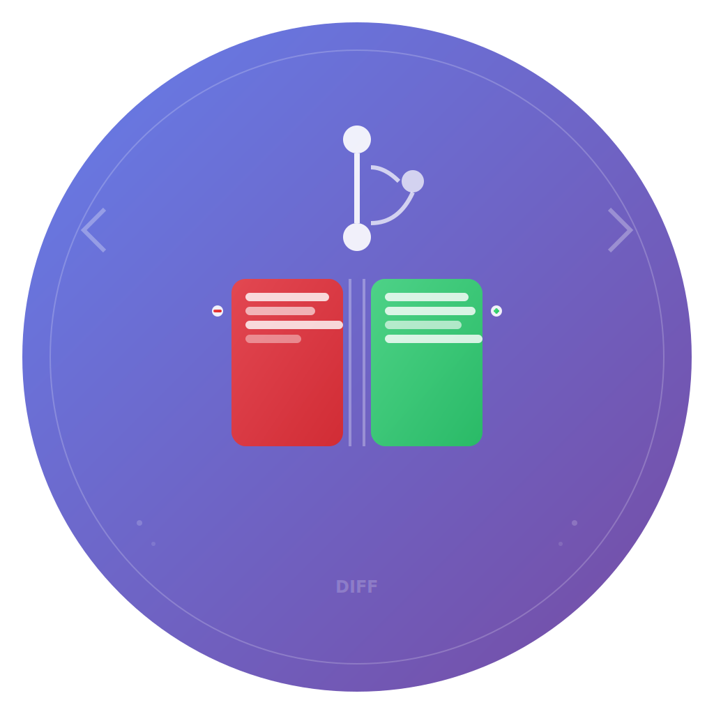

# GitDiffViewer - Distribution Guide

A beautiful native macOS application for viewing git diffs with side-by-side comparison.



## 📦 Ready-to-Use .app Bundle

### Installation (Option 1: Pre-built App)

1. **Download the App**
   - Find `GitDiffViewer.app` in this repository
   - Or build from source using the instructions below

2. **Install to Applications**
   ```bash
   cp -R GitDiffViewer.app /Applications/
   ```

3. **Launch**
   - Open from Applications folder
   - Use Spotlight: `Cmd+Space` → type "GitDiffViewer"
   - Add to Dock for quick access

### Installation (Option 2: Build from Source)

1. **Prerequisites**
   - macOS 14.0 or later
   - Xcode 15.0 or later
   - `xcodegen` (`brew install xcodegen`)

2. **Build and Install**
   ```bash
   ./build_app.sh
   ```
   
   This script will:
   - Generate the Xcode project
   - Build the Release version
   - Install to Applications folder
   - Verify installation

## 🎨 Logo Design

The app features a custom-designed logo that perfectly represents its functionality:

### Design Elements
- **Purple-to-blue gradient background** - Matches the app's color scheme
- **Git branch visualization** - Shows the collaborative nature of version control
- **Side-by-side diff panels** - Core feature representation
- **+ and - indicators** - Classic diff symbols for additions/deletions
- **Code-like lines** - Represents the text/code being compared
- **Professional aesthetics** - Clean, modern macOS-style design

### Technical Details
- **Format**: SVG source with PNG exports at all required sizes
- **Sizes**: 16×16 to 1024×1024 pixels (all @1x and @2x variants)
- **macOS Icon Format**: Proper .icns file with all required resolutions
- **Retina Support**: High-DPI ready for all Apple displays

## 🚀 App Features

### Core Functionality
- **Beautiful Side-by-Side Diff View** - Clean, modern interface
- **Timeline & History** - Browse commit history with metadata
- **File Management** - File tree with status indicators  
- **Menu Bar Integration** - Lives in macOS menu bar for quick access

### User Experience
- **Native macOS Design** - Follows Apple Human Interface Guidelines
- **Keyboard Shortcuts** - `⌘O` (Open), `⌘R` (Refresh), `⌘W` (Close)
- **Persistent Menu Bar** - Always accessible, never intrusive
- **Professional Color Scheme** - Purple-to-blue gradient theme

## 🔧 Technical Specifications

### System Requirements
- **OS**: macOS 14.0 (Sonoma) or later
- **Architecture**: Apple Silicon (M1/M2/M3) and Intel
- **Memory**: 100MB typical usage
- **Storage**: 25MB installed size

### App Bundle Details
- **Bundle ID**: `com.block.goose.GitDiffViewer`
- **Version**: 1.0.0
- **Category**: Developer Tools
- **Code Signing**: Locally signed for development

### Dependencies
- **Git**: Must be installed and available in PATH
- **Swift Runtime**: Bundled with app
- **System Frameworks**: AppKit, SwiftUI, Foundation

## 📋 File Structure

```
GitDiffViewer.app/
├── Contents/
│   ├── Info.plist          # App metadata and configuration
│   ├── MacOS/
│   │   └── GitDiffViewer   # Main executable
│   └── Resources/
│       ├── AppIcon.icns    # App icon (all sizes)
│       └── Assets.car      # Compiled asset catalog
```

## 🛠️ Development

### Build Process
1. **Asset Generation**: SVG → PNG → .icns conversion
2. **Xcode Project**: Generated via `xcodegen` from `project.yml`
3. **Compilation**: Swift 5.9, optimized Release build
4. **Code Signing**: Automatic local signing
5. **Bundle Creation**: Standard macOS app bundle structure

### Maintenance
- Update version in `project.yml` and `Info.plist`
- Regenerate icons if logo changes: run asset generation steps
- Test on multiple macOS versions for compatibility

## 📄 License & Credits

- **License**: MIT License
- **Created by**: Block, Inc.
- **Built with**: SwiftUI, Native macOS APIs, Git CLI tools
- **Logo**: Custom-designed for GitDiffViewer

---

**Ready to use!** 🎉 Your GitDiffViewer app is now a professional macOS application with a beautiful logo, ready to be launched from your Applications folder anytime.
